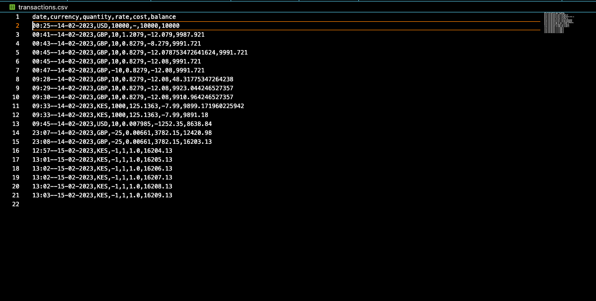

 # The Currency Converter
    #### Video Demo:  <URL HERE>
    #### Description: A currency converting app that enables one to manage a currency portfolio. Final Project for CS50 Introduction to Principles of Programming using Python.


## Initial Launch
The goal of this project is to design a real time currency trading application to be run from the Command Line Interface. The API used is
[Python Exchange Rate API](https://www.exchangerate-api.com/docs/python-currency-api) which generates exchange rates from the dollar to other currencies. Future updates will involve Graphical User Interfaces with the use of libraries like Tkinter or even Pygame. _To be explored_

## Added Functionality
The application is to have three main uses:
- Buying
- Quoting
- Selling

The users buying and selling transactions are to be stored in a CSV file along with time and date of transactions. This is to simulate currency trading as the value of currencies will be realtime thanks to the [Python Exchange Rate API](https://www.exchangerate-api.com/docs/python-currency-api).

For testing, each user will begin with $10,000 and progress while making transactions and storing each transaction in memory. That way, a user can grow a portfolio over time.

_Further functionality to be explored_

## Libraries
### 1. csv

The csv library handles storage of transactions in comma separated value files. The file used is transactions.csv. Details full explained in the [Storage](#storage) section

### 2. tabulate

This is for use when using the interactive displaY


## Functions
### 1. Buy()

This function buys a currency from the base currency and converts it into another currency provided that the user has enough money to buy the currency
```Python
def buy(currency, amount:int) -> None:
    # The variables this function will need, are the type and amount of currency the user is buying.

    # The user makes a transaction, and we get the quote from the quote() function

    # The script opens the file and records the details of the transaction
    balance = get_balance()
    with open("transactions.csv", "a") as file1:
        fieldnames = ["date", "currency", "quantity", "rate",  "cost", "balance"]
        writer = csv.DictWriter(file1, fieldnames=fieldnames)


        #Get the current date as a string
        current_date = datetime.now()
        date_string = current_date.strftime("%H:%M--%d-%m-%Y")
        rate = convert(currency)
        # I want the rate to show the amount I am dividing by, as that is more intuitive

        #Call the convert function
        writer.writerow(
            {
                "date": date_string,
                "currency": currency,
                "quantity":amount,
                "rate": rate,
                "cost": round(-abs(amount / rate), 2),
                "balance": round(balance - abs(amount / rate), 2) 
            }
        )
```

## Problems Encountered
1. ### Limited number of API requests

The [Python Exchange Rate API](https://www.exchangerate-api.com/docs/python-currency-api) only offers 1500 requests per month

2. ### Implementing different functions for the buy and sell

The buy function will store cost in negative values to indicate that money is going out. It will however store quantity in positive values to indicate that currency is being bought, or rather is coming in. Better representation to be researched

3. ### Initialising the csv file once only

Yet to find a way to create the csv file once for every user who installs the program

## Testing
The current tests ensure that appropriate errors are raised when wrong user input is entered. More robust tests will be introduced in the future.
```Python
import pytest
import project
import csv

def test_get_option(monkeypatch):
    monkeypatch.setattr('builtins.input', lambda _: "4")
    with pytest.raises(ValueError):
        project.get_option()

    monkeypatch.setattr('builtins.input', lambda _: "2")
    assert project.get_option() == "2"

def test_sell():
    assert project.sell("KES", 1) == 0
    assert project.sell("notacurrency", 1) == 1

def test_convert():
    assert round(project.convert("UGX"), 1) == round(1 / project.convert("UGX", inverse=True), 1)
    assert round(project.convert("GBP"), 1) == round(1 / project.convert("GBP", inverse=True), 1)
```

### _Corner Cases to Be Considered_
-  Ensuring a buy or sell function call properly appends the transaction to the csv file
- Ensuring that the values gotten from the API are up to date from another verified source. In case of outdated currencies, inform the user


## Storage
User transactions are stored in a csv file
